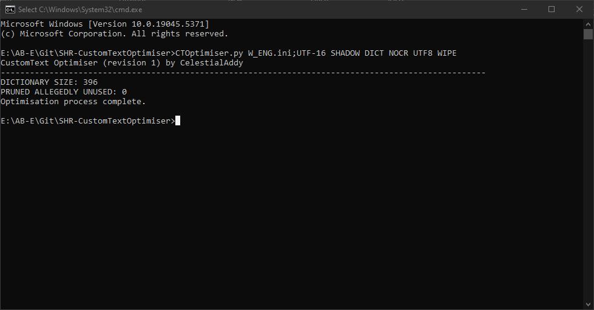

#

# SHR-CustomTextOptimiser
A command-line Python utility that optimises *The Simpsons: Hit & Run* plain-text/CustomText-format/".ini" textbibles in various mostly optional ways, all of which are supported by the mod launcher. Freely open for reuse and such, whatever. Made for fun/jokes.



## Optimisation methods
(Note that as few or as many of these can be used in one run as desired.)
- **Scrub**
	- The only mandatory optimisation method. Comments and blank lines (except one at the end) are removed.
	- Saves an unpredictable amount; depends how much the textbible uses comments/blank lines.
- **Dictionary**
	- Finds repeated words and substitutes them for shorter CustomText variables/references to, if possible.
	- This implementation is primitive, but functional from what I've tested.
	- Might save a few kilobytes at best.
	- CustomText variables are supported in the mod launcher starting at version 1.23.8.
- **LF**
	- Converts Windows "CRLF" (2-byte) newlines to Unix LF (1-byte) newlines.
	- Saves one byte per-newline, of the textbible used CRLF previously.
- **UTF-8**
	- Encodes the textbible as UTF-8, using only 1 byte per ASCII character.
	- Can save quite a bit if a lot of the text uses ASCII characters.
- **Wipe**
	- Removes strings that are listed in "UnusedStrings.txt" (one per-line) as being unused/worthless.
	- This file is not filled with anything by default.
	- Saves an unpredictable amount.

## Installing, Running, and Using
A Python 3 interpreter is required, see [**the Python website**](https://python.org).
  
Requires the "sys" standard library module and the custom "CTDump"/"CTStructure" modules in the included "Module" directory.

This utility is command-line only. Usage (all arguments required):
```
CTOptimiser.py <I> <O> <DICT> <NOCR> <UTF8> <WIPE>
```
- **I**
	- Path/encoding of the input textbible, in the format "path;encoding".
- **O**
	- Path of the output textbible (directory should exist prior).
	- Or `SHADOW` to output as an input clone ("C:/A.ini" -> "C:/A_OP.ini").
	- Or `OVERWRITE` to replace the input file.
- **DICT**
	- Include `DICT` to enable the dictionary method.
	- Set to something else like `.` otherwise.
- **NOCR**
	- Include `NOCR` to enable the LF method.
	- Set to something else like `.` otherwise.
- **UTF8**
	- Include `UTF8` to enable the UTF-8 method.
	- Set to something else like `.` otherwise.
- **WIPE**
	- Include `WIPE` to enable the wipe method.
	- Set to something else like `.` otherwise.

You could also use a Batch (".bat"/".cmd") script in the same directory on Windows, such as:
```
CTOptimiser.py C:/In.ini C:/Out.ini DICT . UTF8 .
pause
```
(Inclusion of `pause` is recommended here, otherwise the console window will close before success/error messages can be read.)

#
